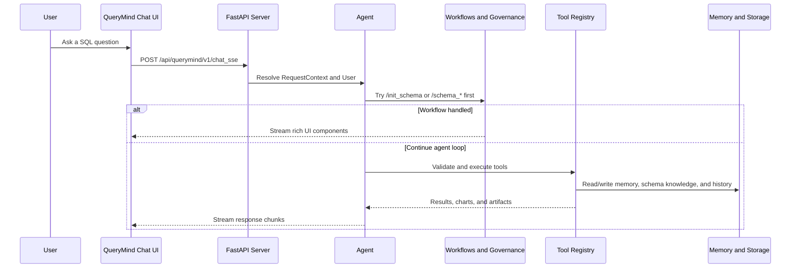

# QueryMind: Build SQL Agents for Real-World Business Databases

QueryMind is an agent framework for building LLM-powered agents specialized in real-world Text2SQL Tasks with agentic retrieval capabilities and enterprise-grade security.

[](https://python.org)
[](README_zh.md)
[](LICENSE)

## Enterprise Portfolio Edition

This fork is maintained by [luyan9513](https://github.com/luyan9513) as an enterprise analytics portfolio project. It keeps QueryMind's upstream agent, schema-memory, and SQL-governance foundation while adding a verified local business-data workflow and independently maintained improvements:

- DeepSeek for the main agent, with SiliconFlow-backed Mem0 LLM and `BAAI/bge-m3` embeddings.
- Read-only PostgreSQL PK/FK extraction through `pg_catalog`, including composite and cross-schema relationships.
- Persistent LLM-generated conversation titles, automatic history refresh, workflow message storage, and graceful fallback.
- A 24-case Chinese AdventureWorks business benchmark with deterministic full-result checks, Schema Recall, first-attempt metrics, failure attribution, trace redaction, and an interactive HTML report.
- Database-scoped Schema Memory retrieval plus an independent Chinook benchmark and 12-metric catalog for second-source admission; the v0.9 development set has reached 50/100 cases.
- AdventureWorks validation across 68 tables and 456 fields, plus an initialized 11-table Chinook source; the current formal test scope is `229 passed, 1 warning`.

See [Portfolio Ownership and Evidence](docs/portfolio/ownership.md) for the upstream boundary, personal contributions, verification evidence, and roadmap.

https://github.com/user-attachments/assets/e87fc532-ef82-4765-96a7-e693924de5c7

<table>
  <tr>
    <td align="center" valign="top" width="33%">
      
      <br /><sub>Chat panel</sub>
    </td>
    <td align="center" valign="top" width="33%">
      
      <br /><sub>Schema management</sub>
    </td>
    <td align="center" valign="top" width="33%">
      
      <br /><sub>User query</sub>
    </td>
  </tr>
  <tr>
    <td align="center" valign="top" width="33%">
      
      <br /><sub>Query results</sub>
    </td>
    <td align="center" valign="top" width="33%">
      
      <br /><sub>Summary</sub>
    </td>
    <td align="center" valign="top" width="33%">
      
      <br /><sub>Data Visualization</sub>
    </td>
  </tr>
</table>

---

## 🌟 Core Features

| Feature | Description |
|---------|-------------|
| **🗄️Multi-layer memory planes** | conversation storage, agent memory, and schema memory are independent, which keeps history, retrieval, and schema knowledge from bleeding into each other. |
| **🎛️4 Schema Memory Search Modes** | hybrid / vector / graph / expand - 4 modes allow the agent choose suitable schema retrieval strategy for each query through agentic decision-making. |
| **🧮Schema Management** | UI pages and commands make business database metadata easier to maintain, update, manually refine, and enrich with AI, keeping the agent grounded in real-world business data. |
| **🔐SQL safety and RLS** | group-aware tool access and pre-execution SQL governance protect business databases with row-level security, injection detection, and query complexity controls. |
| **🛠️Integration flexibility** | QueryMind works with OpenAI-compatible, Anthropic, and vLLM model backends, plus PostgreSQL, SQLite, and Neo4j-backed storage and data integrations. |
| **🗒️Operational visibility** | metrics, audit logs, and evaluation tools make QueryMind runs easier to monitor, inspect, and reproduce. |

When the loop runs, QueryMind can stream progress updates, schema results, SQL results, charts, cards, and follow-up actions back to the frontend instead of returning plain text only.


## 🏗️ What is New in QueryMind compared to Vanna 2.0

💡QueryMind is inspired by [Vanna's agent framework](https://github.com/vanna-ai/vanna) and adapts Vanna's webcomponents into a customized demo web experience.

It builds on that foundation with differences in runtime structure, governance, memory, and business database integration compared to Vanna 2.0.

- **Schema governance** - schema governance standardizes schema retrieval traces, tracks discovered database context, and surfaces lock / recap state as runtime notices while keeping the agent grounded in the right business schema.
- **SQL governance** - SQL governance standardizes SQL writing patterns, feeds execution feedback into the next reasoning turn, and surfaces anchor / freeze / recap state as runtime notices to help the agent recover from SQL semantic false-negative traps.
- **Two memory planes** - agent memory and schema memory serve different roles: agent memory captures reusable tool-use experience, while schema memory grounds SQL generation with Neo4j + Mem0 hybrid retrieval over database knowledge.
- **Schema management** - schema management panel and deterministic slash commands serves as the supporting infrastructure for schema memory and schema retrieval tool, grounding the agent in real-world business databases before the normal LLM/tool loop begins.

### 📝 Changelog
<details>
<summary> <b>🔥 2026-05-11</b> </summary>

- Unified QueryMind's context assembly around a stable system prompt, message-side runtime notices, and tool-result metadata.
- Moved dynamic schema lock, schema summary, SQL anchor / freeze / recap, and memory advisory content out of the system prompt path.
- Kept schema_retrieve visibility on the request-time filter path instead of mutating the tool registry.
- Reworked runtime notices so dynamic notices are appended at the tail, while short visible signals stay in the notice and finer-grained detail lives in metadata.
- Aligned the detail-expression profile tags (`case_when`, `null_handling`, `comparison`, `distinct`) with the existing prompt guidance, and updated the prompt-chain / agent-loop / governance docs plus tests to validate tail-appended notices and metadata snapshots.
- Added a structural rewrite lane for aggregation / rollup / multi-CTE SQL turns so local repair stays focused on window / join / filtering cases.
- Added detail-family guardrails for `case_when`, `null_handling`, `comparison`, and `distinct` so projection-preserving turns stay conservative.
- On the evaluation test set, SQL accuracy stayed in the 66%-72% range with no regression, and the input cache hit rate improved from 44.28% to 69.35%.
</details>

## 🔄 QueryMind's Agent Loop


## 🧠 How It Works



## Get Started

QueryMind provides a bundled demo agent for quickly trying its end-to-end capabilities, with the backend, demo frontend, memory, governance, and evaluation components already wired together.

The sample agent is assembled like this:

```python
from QueryMind import (
    Agent,
    AgentConfig,
    CompositeLlmContextEnhancer,
    CompositeWorkflowHandler,
    ExponentialBackoffStrategy,
    Neo4jMem0SchemaManagementService,
    Neo4jMem0SchemaMemory,
    PrometheusObservabilityProvider,
)
from QueryMind.core.agent import build_schema_governance_stack, build_sql_governance_stack
from QueryMind.core.enricher import SchemaRetrieveContextEnricher
from QueryMind.integrations.agentmemory import Mem0AgentMemory, create_config_from_env
from QueryMind.integrations.auditlogger import PostgresAuditLogger
from QueryMind.integrations.llmservice import OpenAILlmService
from QueryMind.integrations.local import FileSystemConversationStore
from QueryMind.integrations.schemamemory import Mem0VectorConfig, Neo4jConfig
from QueryMind.rls_registry import RLSToolRegistry

schema_governance = build_schema_governance_stack()
sql_governance = build_sql_governance_stack()

agent = Agent(
    llm_service=OpenAILlmService(...),
    tool_registry=RLSToolRegistry(audit_logger=PostgresAuditLogger(...)),
    user_resolver=...,
    agent_memory=Mem0AgentMemory(config=create_config_from_env()),
    conversation_store=FileSystemConversationStore(...),
    config=AgentConfig(...),
    workflow_handler=CompositeWorkflowHandler([...]),
    schema_memory=Neo4jMem0SchemaMemory(
        neo4j_config=Neo4jConfig.from_env(),
        mem0_config=Mem0VectorConfig.from_env(),
    ),
    schema_management_service=Neo4jMem0SchemaManagementService(...),
    hooks=[schema_governance.hook, sql_governance.hook],
    llm_middlewares=[schema_governance.middleware, sql_governance.middleware],
    llm_context_enhancer=CompositeLlmContextEnhancer([...]),
    context_enrichers=[SchemaRetrieveContextEnricher(...)],
    error_recovery_strategy=ExponentialBackoffStrategy(),
    observability_provider=PrometheusObservabilityProvider(),
)
```

### Prerequisites

- QueryMind Python SDK: see [0. QueryMind Python SDK](docs/en/support/prerequisite.md#querymind-python-sdk).
- PostgreSQL & PgVector: see [1. PostgreSQL & PgVector](docs/en/support/prerequisite.md#postgresql-pgvector).
- AdventureWorks: see [2. AdventureWorks](docs/en/support/prerequisite.md#adventureworks).
- Environment Variables Configuration: see [3. Environment Variables Configuration](docs/en/support/prerequisite.md#environment-variables-configuration).

The deployment guide also covers Neo4j, PostgreSQL audit logging, and the webcomponent build that the demo launcher needs.

### Dependencies Installation

```bash
uv sync
cd frontends/webcomponent
npm install
npm run build
```

If you prefer editable installs, `pip install -e .` works as a fallback.

### Use `querymind` to start the project

```bash
querymind agent-only
querymind web-only
querymind demo
```

- `agent-only`: start the backend agent only.
- `web-only`: start the demo frontend only.
- `demo`: start both services and open the demo page automatically.

The same modes are exposed through the `querymind` console script and the repository root `querymind.py` wrapper.

### Direct Launch

```bash
python my_agent.py
python webcomponent_demo.py --api-base http://127.0.0.1:8000
```

### v0.2 Text2SQL Evaluation

The upstream project already provided the evaluation runner, resumable batch CLI, SQL executor, LLM judge, and basic/expansion datasets. This portfolio fork extends that foundation with a Chinese business benchmark and deterministic enterprise metrics.

```bash
cd /Users/luyan/Documents/Projects/01-QueryMind/repo/QueryMind-personal
EVAL_DATASET_PATH=src/evals/datasets/adventureworks_business_zh.yaml \
  .venv/bin/python my_evaluation.py
```

The report now includes Schema Recall before the first SQL attempt, SQL execution success, full-result correctness, first-SQL correctness, tool-call count, P95 latency, token usage, optional provider-price snapshots, and primary/secondary failure categories. Exported JSON omits result previews and raw judge output. Configure prices only after checking the provider's current official pricing; leaving any role's price incomplete makes its cost display `N/A`.

The 24 reference SQL statements passed a local PostgreSQL read-only execution check. The archived DeepSeek v4 Flash baseline completed all 24 cases: final SQL execution success was 100.00%, strict full-result correctness was 29.17%, first-SQL strict correctness was 8.33%, and Schema Recall was 62.50%. The upstream LLM Judge pass rate was 75.00%, but it accepted 11 cases rejected by deterministic full-result comparison, so the project treats 29.17% as the baseline accuracy signal and keeps Judge pass rate as a separate diagnostic metric.

### v0.2.1 Accuracy and Recovery Iteration

The next iteration adds explicit result-comparison policies, SQL output contracts, offline rescoring, one-hop FK expansion for hybrid schema retrieval, a database-agnostic query-contract prompt, configurable agent temperature, and deterministic recovery from repeated rejected metadata queries. Ground-truth SQL and benchmark contracts remain evaluator-only and are not injected into the runtime agent.

Five real-model experiments were retained, including regressions and one interrupted low-temperature run. The final DeepSeek v4 Pro run completed 24/24 cases with 100.00% final SQL execution, 37.50% strict result correctness, 54.17% business-equivalent correctness, 33.33% first-SQL strict correctness, 75.00% Schema Recall, and 3.88 average tool calls. Compared with the Flash baseline, strict correctness increased by 8.33 percentage points and average tool calls fell by 49.5%, while estimated model cost rose from USD 0.064537 to USD 0.145265 (about 2.25x).

These figures apply only to the frozen 24-case AdventureWorks benchmark and the recorded model configuration. They are not a guarantee for arbitrary databases. New data sources require their own schema initialization, business definitions, frozen benchmark, and baseline.

### v0.3 Schema-Grounded Query Planning

The v0.3 worktree keeps the upstream Agent Loop and adds a `submit_query_plan` stage between schema retrieval and SQL execution. A turn-local evidence set records retrieved physical tables, columns, and primary keys. The runtime rejects plans without evidence and rejects SQL that drifts from the accepted tables, fields, filters, output shape, aggregation, grouping, ordering, or limit.

Schema recovery now supports direct lookup by known physical table names, qualified-field normalization, exact-field-first search, field-coverage ranking, complete graph-result hydration, and full-field display for exact lookups. The evaluation report also separates evaluator-side SQL re-execution from SQL actually accepted and executed inside the Agent.

The final three-case DeepSeek v4 Pro smoke run reached 100.00% strict/business correctness, SQL Contract, Schema Recall, and Agent SQL execution success; first-SQL correctness was 66.67% and average Agent time was 28.30 seconds. This is a recovery-path smoke test, not a replacement for the frozen 24-case benchmark and not a cross-database accuracy claim. See [the v0.3 design and evidence note](docs/portfolio/v0.3-query-plan-recovery.md).

### v0.4 Accuracy and Agent Value Harness

The v0.4 harness now isolates three evaluation strategies without changing the production chat entry point:

- `s0`: one fixed-budget Schema Memory retrieval, one LLM SQL generation, and one governed SQL attempt; no Agent Loop or repair.
- `s1`: the upstream Agent Loop, SQL Governance, Schema Memory, and recovery, without registering the portfolio Query Plan tool.
- `s2`: the same Agent path with the portfolio Query Plan evidence gate enabled.

Each checkpoint stores its mode, and resume lookup refuses to mix modes. Reports now include P50/P95/max latency, per-tool totals, 95% Wilson intervals, wrong-but-executed rate, Recovery Yield, False Block Rate, and Plan Acceptance Precision. A separate comparison command rejects A/B claims when the dataset, model, database, judge, temperature, concurrency, or test-case IDs differ.

```bash
export EVAL_DATABASE_SNAPSHOT_ID=adventureworks_20260729
export EVAL_SCHEMA_SNAPSHOT_ID=adventureworks_schema_20260729

EVAL_MODE=s0 .venv/bin/python my_evaluation.py --run-id aw_s0_r1
EVAL_MODE=s1 .venv/bin/python my_evaluation.py --run-id aw_s1_r1
EVAL_MODE=s2 .venv/bin/python my_evaluation.py --run-id aw_s2_r1

PYTHONPATH=src .venv/bin/python -m evals.compare_runs \
  --s0-report eval_output/eval_results/<s0-run>/evaluation_report.json \
  --s1-report eval_output/eval_results/<s1-run>/evaluation_report.json \
  --s2-report eval_output/eval_results/<s2-run>/evaluation_report.json \
  --output-dir eval_output/comparisons/aw_r1
```

The first controlled real-model round is complete: 24 frozen questions per mode, 72 samples in total, with the comparison checker reporting `comparable=true`.

| Mode | Strict accuracy | Business accuracy | Wrong but executed | Average / P95 latency |
|---|---:|---:|---:|---:|
| S0 | 20.83% | 25.00% | 62.50% | 2.01s / 2.65s |
| S1 | 33.33% | 41.67% | 54.17% | 17.09s / 26.58s |
| S2 | 50.00% | 54.17% | 41.67% | 29.98s / 53.13s |

This is evidence of an observed gain on one AdventureWorks run, not a general accuracy guarantee. S2 is not ready to become the unconditional default: 41.67% of cases still executed an incorrect answer, its P95 latency exceeded 53 seconds, and only one run per mode has been completed. The generated detailed reports retain every question, reference SQL, Agent SQL, failure location, cause, and recommendation while omitting result rows and judge raw text.

### v0.5 Adaptive Query Plan Routing

The v0.5 work adds a database-agnostic `disabled / always / adaptive` Query Plan mode. In adaptive mode, evidence-backed single-table SQL without joins, subqueries, windows, distinct operations, time-series bucketing, or other high-risk shapes may use a fast path. Complex SQL still requires the v0.3 Query Plan, and both routes continue through the upstream SQL Governance and RLS checks.

Two complete S3 runs on the same frozen 24-case benchmark both reached 54.17% strict and 62.50% business accuracy, with 25.00% wrong-but-executed and 87.50% automatic-answer coverage. Their P95 latency was 38.16 and 43.78 seconds, versus 53.13 seconds for the previous S2 run. Per-case business correctness matched on 20/24 cases, so the repeated aggregate rate is not evidence of deterministic per-question stability.

The normal chat default remains `QUERY_PLAN_MODE=always`. Adaptive routing is opt-in until a second data source and its own admission benchmark pass. See [the v0.5 implementation record](docs/portfolio/v0.5-adaptive-query-plan-routing.md).

### v0.6 Structured Recovery and SQL Review Experiment

The v0.6 experiment modifies the upstream Agent Loop with deterministic failure classification, repeated-failure fingerprints, action-specific recovery, and an optional high-risk SQL Reviewer. A separate S4 evaluation mode keeps this experiment isolated from S0-S3 and includes Reviewer usage in latency, tool, token, and cost metrics.

The complete 24-case S4 run did not outperform S3. Strict accuracy stayed at 54.17%, while business accuracy fell from 62.50% to 54.17%, wrong-but-executed increased from 25.00% to 29.17%, P95 latency increased from 38.16 to 51.61 seconds, and estimated cost increased by 47.61%. The Reviewer approved 19 of 20 reviews, including several semantically wrong SQL queries.

For that reason, `STRUCTURED_FAILURE_RECOVERY=false` and `SQL_REVIEW_MODE=disabled` remain the normal defaults. The code and negative result are retained as auditable experimental evidence, not presented as an accuracy improvement. See [the v0.6 implementation and evaluation record](docs/portfolio/v0.6-structured-recovery-and-sql-review.md).

### v0.7 Data-source Semantic Contracts

The v0.7 work adds versioned, data-source-owned metric contracts between Schema Retrieve, Query Plan, and governed SQL execution. Contracts define approved formulas, source tables, required fields, base grain, time fields, filters, and aliases. The generic engine contains no AdventureWorks table or question rules; AdventureWorks is one evaluated catalog instance with 14 approved metrics.

The final S5 run completed the same frozen 24 questions under the same model and snapshots. It reached 58.33% strict accuracy (14/24), 66.67% business accuracy (16/24), 87.50% answer coverage (21/24), 76.19% business precision among executed answers, and 20.83% wrong-but-executed (5/24). P50/P95 Agent latency was 22.11/33.92 seconds. The S0-S5 comparison reported `comparable=true`; versus the best S3 run, S5 gained one strict and one business-correct case while keeping coverage unchanged.

These are small-sample AdventureWorks results, not a cross-database guarantee. Normal chat keeps `SEMANTIC_CONTRACT_MODE=disabled`; every new data source needs its own catalog, frozen benchmark, and admission result. See [the v0.7 design and evidence record](docs/portfolio/v0.7-semantic-contract-governance.md).

### v0.8 Multi-source Isolation and Chinook Admission

The v0.8 work first closes a source-isolation gap in Schema Memory: vector filters, Neo4j traversal, schema hydration, and RRF identities now carry the active database name. An explicit fail-closed migration method checks the legacy graph before replacing the old `schema + table` uniqueness constraint; it is not run automatically during startup.

The second source is the official Chinook 1.4.5 PostgreSQL sample. The local snapshot contains 11 tables, 64 columns, 11 foreign keys, and 15,607 rows. A separate Chinook 1.0.0 semantic catalog defines 12 metrics, and a separate 24-case Chinese benchmark covers single-table aggregation, multi-hop joins, a bridge table, a self-join, HAVING, CTEs, subqueries, and windows. All 24 reference SQL statements execute in read-only transactions, return non-empty results, and satisfy their declared SQL contracts.

The explicit Neo4j migration and Chinook Schema Memory initialization are complete. After generic fixes for HAVING-plan alignment, CTE select-scope analysis, expression wrappers, numeric fingerprints, and an explicit date-granularity comparison policy, a fairness-checked 24-case r6 run found S0/S3/S5 business accuracy of 66.67%/70.83%/83.33%, wrong-but-executed rates of 33.33%/25.00%/12.50%, and P95 latency of 1.74/17.51/14.39 seconds. S5 passes the predefined 24-case development gates, but this remains a single-run development admission rather than a production accuracy guarantee. See [the v0.8 design and current evidence](docs/portfolio/v0.8-multi-source-admission.md).

The v0.9 benchmark work is now in development: a machine-readable 100-case admission profile, coverage checker, reference-SQL-only validator, SQL feature-alternative contracts, and two reviewed expansion batches are implemented. The current set is 50/100; all 50 reference SQL statements execute read-only with non-empty results. No 50-case Agent accuracy is claimed yet. See [the v0.9 benchmark plan and status](docs/portfolio/v0.9-production-benchmark.md).

The v0.10-A1 implementation now provides a bounded Run/Event lifecycle, an atomic single-process development store, mandatory idempotent creation, tenant/user-scoped reads, ordered event cursors, optimistic versions, and idempotent cancellation. The existing Chat Agent is not yet executed by a background Run worker, and live SSE, Step/Tool traces, approval recovery, and multi-instance storage remain pending. The project intentionally keeps the current governed single-Agent pattern instead of adding a multi-Agent layer without measured benefit. See [the product scope and KPIs](docs/portfolio/product-scope-and-kpis.md), [the v0.10 runtime design and status](docs/portfolio/v0.10-governed-agent-runtime.md), and [ADR-0001](docs/adr/0001-single-agent-governed-runtime.md).

The latest formal Python test scope is `229 passed, 1 warning`.

### Web Component

```html
<script type="module" src="./frontends/webcomponent/dist/querymind-components.js"></script>
<querymind-chat
  api-base="http://localhost:8000"
  title="QueryMind Chat">
</querymind-chat>
```

Use this from any page that can load the built bundle. The component talks to `POST /api/querymind/v1/chat_sse`, `POST /api/querymind/v1/chat_poll`, and `WS /api/querymind/v1/chat_websocket`.

## Full Documentation

The handbook expands the README into components, advanced-features, use-case, and support pages.

- English: [docs/en/querymind.md](docs/en/querymind.md)
- 中文: [docs/zh/querymind.md](docs/zh/querymind.md)

## 👉 Ongoing and Future Actions

### Ongoing

1. Complete v0.10-A2 by adapting the existing single Agent to queued Run execution, live SSE continuation, restart recovery, and concurrent cancellation; then add Step/Tool trace and redaction without changing SQL generation policy.

<figure>
  
  <figcaption>Eval-driven iterations: use benchmark feedback to refine prompts, governance, and SQL recovery behavior.</figcaption>
</figure>

2. Keep the Chinook benchmark paused at 50/100 while the runtime event contract changes. Resume the [v0.9 plan](docs/portfolio/v0.9-production-benchmark.md), freeze a 60/20/20 development/test/holdout split, and run repeated real-model evaluation only after the v0.10 interfaces stabilize.


### Future Actions

1. Evaluate QueryMind against BIRD-SQL after checking the latest official dataset, license, format, and scoring documentation.
2. Explore Agentic RL on top of QueryMind only after a reliable multi-source evaluation baseline exists.
3. Improve schema retrieval query rewriting so complex user questions can be split into multiple schema-retrieve calls, reducing the chance that multi-table or multi-field descriptions get compressed into a single query and fall into a retrieval dead-end.
4. Explore alternative schema retrieval / indexing architectures, including PageIndex-style reasoning-first, vector-light or vector-free RAG approaches and stronger multi-hop schema retrieval over the business schema graph.
5. Add business-level scoping options, such as manual business-domain selection, to narrow the schema-retrieve search space before retrieval starts.
6. Keep tightening the agent with evaluation results and governance feedback.

<a id="license"></a>

## License

QueryMind is released under the MIT License. See [LICENSE](LICENSE).

This project is developed for personal learning and research purposes. Special thanks to [Vanna](https://github.com/vanna-ai/vanna) for being an important reference point and source of inspiration for this work.
