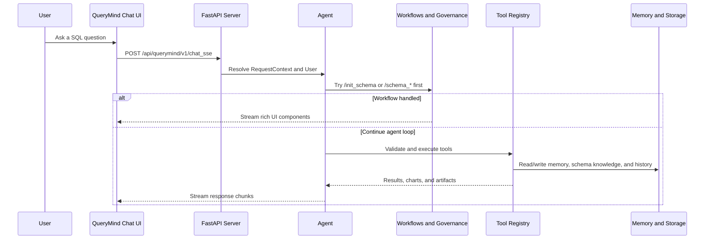

# QueryMind: Build SQL Agents for Real-World Business Databases

QueryMind is an agent framework for building LLM-powered agents specialized in real-world Text2SQL Tasks with agentic retrieval capabilities and enterprise-grade security.

[](https://python.org)
[](README_zh.md)
[](LICENSE)

## Enterprise Portfolio Edition

This fork is maintained by [luyan9513](https://github.com/luyan9513) as an enterprise analytics portfolio project. It keeps QueryMind's upstream agent, schema-memory, and SQL-governance foundation while adding a verified local business-data workflow and independently maintained improvements:

- DeepSeek for the main agent, with SiliconFlow-backed Mem0 LLM and `BAAI/bge-m3` embeddings.
- Read-only PostgreSQL PK/FK extraction through `pg_catalog`, including composite and cross-schema relationships.
- Persistent LLM-generated conversation titles, automatic history refresh, workflow message storage, and graceful fallback.
- AdventureWorks validation across 68 tables and 456 fields, with 117 Python tests passing.

See [Portfolio Ownership and Evidence](docs/portfolio/ownership.md) for the upstream boundary, personal contributions, verification evidence, and roadmap.

https://github.com/user-attachments/assets/e87fc532-ef82-4765-96a7-e693924de5c7

<table>
  <tr>
    <td align="center" valign="top" width="33%">
      
      <br /><sub>Chat panel</sub>
    </td>
    <td align="center" valign="top" width="33%">
      
      <br /><sub>Schema management</sub>
    </td>
    <td align="center" valign="top" width="33%">
      
      <br /><sub>User query</sub>
    </td>
  </tr>
  <tr>
    <td align="center" valign="top" width="33%">
      
      <br /><sub>Query results</sub>
    </td>
    <td align="center" valign="top" width="33%">
      
      <br /><sub>Summary</sub>
    </td>
    <td align="center" valign="top" width="33%">
      
      <br /><sub>Data Visualization</sub>
    </td>
  </tr>
</table>

---

## 🌟 Core Features

| Feature | Description |
|---------|-------------|
| **🗄️Multi-layer memory planes** | conversation storage, agent memory, and schema memory are independent, which keeps history, retrieval, and schema knowledge from bleeding into each other. |
| **🎛️4 Schema Memory Search Modes** | hybrid / vector / graph / expand - 4 modes allow the agent choose suitable schema retrieval strategy for each query through agentic decision-making. |
| **🧮Schema Management** | UI pages and commands make business database metadata easier to maintain, update, manually refine, and enrich with AI, keeping the agent grounded in real-world business data. |
| **🔐SQL safety and RLS** | group-aware tool access and pre-execution SQL governance protect business databases with row-level security, injection detection, and query complexity controls. |
| **🛠️Integration flexibility** | QueryMind works with OpenAI-compatible, Anthropic, and vLLM model backends, plus PostgreSQL, SQLite, and Neo4j-backed storage and data integrations. |
| **🗒️Operational visibility** | metrics, audit logs, and evaluation tools make QueryMind runs easier to monitor, inspect, and reproduce. |

When the loop runs, QueryMind can stream progress updates, schema results, SQL results, charts, cards, and follow-up actions back to the frontend instead of returning plain text only.


## 🏗️ What is New in QueryMind compared to Vanna 2.0

💡QueryMind is inspired by [Vanna's agent framework](https://github.com/vanna-ai/vanna) and adapts Vanna's webcomponents into a customized demo web experience.

It builds on that foundation with differences in runtime structure, governance, memory, and business database integration compared to Vanna 2.0.

- **Schema governance** - schema governance standardizes schema retrieval traces, tracks discovered database context, and surfaces lock / recap state as runtime notices while keeping the agent grounded in the right business schema.
- **SQL governance** - SQL governance standardizes SQL writing patterns, feeds execution feedback into the next reasoning turn, and surfaces anchor / freeze / recap state as runtime notices to help the agent recover from SQL semantic false-negative traps.
- **Two memory planes** - agent memory and schema memory serve different roles: agent memory captures reusable tool-use experience, while schema memory grounds SQL generation with Neo4j + Mem0 hybrid retrieval over database knowledge.
- **Schema management** - schema management panel and deterministic slash commands serves as the supporting infrastructure for schema memory and schema retrieval tool, grounding the agent in real-world business databases before the normal LLM/tool loop begins.

### 📝 Changelog
<details>
<summary> <b>🔥 2026-05-11</b> </summary>

- Unified QueryMind's context assembly around a stable system prompt, message-side runtime notices, and tool-result metadata.
- Moved dynamic schema lock, schema summary, SQL anchor / freeze / recap, and memory advisory content out of the system prompt path.
- Kept schema_retrieve visibility on the request-time filter path instead of mutating the tool registry.
- Reworked runtime notices so dynamic notices are appended at the tail, while short visible signals stay in the notice and finer-grained detail lives in metadata.
- Aligned the detail-expression profile tags (`case_when`, `null_handling`, `comparison`, `distinct`) with the existing prompt guidance, and updated the prompt-chain / agent-loop / governance docs plus tests to validate tail-appended notices and metadata snapshots.
- Added a structural rewrite lane for aggregation / rollup / multi-CTE SQL turns so local repair stays focused on window / join / filtering cases.
- Added detail-family guardrails for `case_when`, `null_handling`, `comparison`, and `distinct` so projection-preserving turns stay conservative.
- On the evaluation test set, SQL accuracy stayed in the 66%-72% range with no regression, and the input cache hit rate improved from 44.28% to 69.35%.
</details>

## 🔄 QueryMind's Agent Loop


## 🧠 How It Works



## Get Started

QueryMind provides a bundled demo agent for quickly trying its end-to-end capabilities, with the backend, demo frontend, memory, governance, and evaluation components already wired together.

The sample agent is assembled like this:

```python
from QueryMind import (
    Agent,
    AgentConfig,
    CompositeLlmContextEnhancer,
    CompositeWorkflowHandler,
    ExponentialBackoffStrategy,
    Neo4jMem0SchemaManagementService,
    Neo4jMem0SchemaMemory,
    PrometheusObservabilityProvider,
)
from QueryMind.core.agent import build_schema_governance_stack, build_sql_governance_stack
from QueryMind.core.enricher import SchemaRetrieveContextEnricher
from QueryMind.integrations.agentmemory import Mem0AgentMemory, create_config_from_env
from QueryMind.integrations.auditlogger import PostgresAuditLogger
from QueryMind.integrations.llmservice import OpenAILlmService
from QueryMind.integrations.local import FileSystemConversationStore
from QueryMind.integrations.schemamemory import Mem0VectorConfig, Neo4jConfig
from QueryMind.rls_registry import RLSToolRegistry

schema_governance = build_schema_governance_stack()
sql_governance = build_sql_governance_stack()

agent = Agent(
    llm_service=OpenAILlmService(...),
    tool_registry=RLSToolRegistry(audit_logger=PostgresAuditLogger(...)),
    user_resolver=...,
    agent_memory=Mem0AgentMemory(config=create_config_from_env()),
    conversation_store=FileSystemConversationStore(...),
    config=AgentConfig(...),
    workflow_handler=CompositeWorkflowHandler([...]),
    schema_memory=Neo4jMem0SchemaMemory(
        neo4j_config=Neo4jConfig.from_env(),
        mem0_config=Mem0VectorConfig.from_env(),
    ),
    schema_management_service=Neo4jMem0SchemaManagementService(...),
    hooks=[schema_governance.hook, sql_governance.hook],
    llm_middlewares=[schema_governance.middleware, sql_governance.middleware],
    llm_context_enhancer=CompositeLlmContextEnhancer([...]),
    context_enrichers=[SchemaRetrieveContextEnricher(...)],
    error_recovery_strategy=ExponentialBackoffStrategy(),
    observability_provider=PrometheusObservabilityProvider(),
)
```

### Prerequisites

- QueryMind Python SDK: see [0. QueryMind Python SDK](docs/en/support/prerequisite.md#querymind-python-sdk).
- PostgreSQL & PgVector: see [1. PostgreSQL & PgVector](docs/en/support/prerequisite.md#postgresql-pgvector).
- AdventureWorks: see [2. AdventureWorks](docs/en/support/prerequisite.md#adventureworks).
- Environment Variables Configuration: see [3. Environment Variables Configuration](docs/en/support/prerequisite.md#environment-variables-configuration).

The deployment guide also covers Neo4j, PostgreSQL audit logging, and the webcomponent build that the demo launcher needs.

### Dependencies Installation

```bash
uv sync
cd frontends/webcomponent
npm install
npm run build
```

If you prefer editable installs, `pip install -e .` works as a fallback.

### Use `querymind` to start the project

```bash
querymind agent-only
querymind web-only
querymind demo
```

- `agent-only`: start the backend agent only.
- `web-only`: start the demo frontend only.
- `demo`: start both services and open the demo page automatically.

The same modes are exposed through the `querymind` console script and the repository root `querymind.py` wrapper.

### Direct Launch

```bash
python my_agent.py
python webcomponent_demo.py --api-base http://127.0.0.1:8000
```

### Web Component

```html
<script type="module" src="./frontends/webcomponent/dist/querymind-components.js"></script>
<querymind-chat
  api-base="http://localhost:8000"
  title="QueryMind Chat">
</querymind-chat>
```

Use this from any page that can load the built bundle. The component talks to `POST /api/querymind/v1/chat_sse`, `POST /api/querymind/v1/chat_poll`, and `WS /api/querymind/v1/chat_websocket`.

## Full Documentation

The handbook expands the README into components, advanced-features, use-case, and support pages.

- English: [docs/en/querymind.md](docs/en/querymind.md)
- 中文: [docs/zh/querymind.md](docs/zh/querymind.md)

## 👉 Ongoing and Future Actions

### Ongoing

1. Iterate on the AdventureWorks micro-benchmark by analyzing tool-call chains, prompt injection patterns, and common SQL failure modes.

<figure>
  
  <figcaption>Eval-driven iterations: use benchmark feedback to refine prompts, governance, and SQL recovery behavior.</figcaption>
</figure>

2. Evaluate QueryMind against BIRD-SQL to measure text-to-SQL capability.


### Future Actions

1. Explore Agentic RL on top of QueryMind.
2. Improve schema retrieval query rewriting so complex user questions can be split into multiple schema-retrieve calls, reducing the chance that multi-table or multi-field descriptions get compressed into a single query and fall into a retrieval dead-end.
3. Explore alternative schema retrieval / indexing architectures, including PageIndex-style reasoning-first, vector-light or vector-free RAG approaches and stronger multi-hop schema retrieval over the business schema graph.
4. Add business-level scoping options, such as manual business-domain selection, to narrow the schema-retrieve search space before retrieval starts.
5. Keep tightening the agent with evaluation results and governance feedback.

<a id="license"></a>

## License

QueryMind is released under the MIT License. See [LICENSE](LICENSE).

This project is developed for personal learning and research purposes. Special thanks to [Vanna](https://github.com/vanna-ai/vanna) for being an important reference point and source of inspiration for this work.
