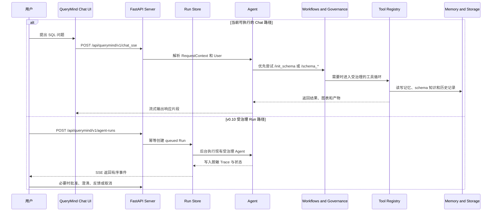

# QueryMind: 为真实业务数据库构建 SQL Agents

QueryMind 是一个面向企业经营数据问答的可治理 Text2SQL Agent。它在 QueryMind 上游框架之上组合 Schema 检索、查询规划、SQL 安全控制、评测和可审计的运行状态。

[](https://python.org)
[](README.md)
[](LICENSE)

## 企业经营数据问答扩展版

本 Fork 由 [luyan9513](https://github.com/luyan9513) 持续维护，目标用户是需要从关系型数据库获得可靠答案、但不能直接放任模型执行 SQL 的分析人员和业务人员。

项目复用 QueryMind 上游已有的 Agent Loop、Schema Memory、SQL Governance、RLS 和 Web Component。下游改造聚焦环境落地、模型适配、准确率评测、多数据源隔离、业务语义约束、失败恢复实验和持久化 Run/Event 契约：

- 主 Agent 使用 DeepSeek，Mem0 LLM 与 `BAAI/bge-m3` Embedding 接入硅基流动。
- 在只读 PostgreSQL 账号下通过 `pg_catalog` 抽取主外键，支持复合外键和跨 Schema 关系。
- 实现 LLM 会话标题、历史自动刷新、Workflow 消息持久化和失败回退。
- 建立 24 题 AdventureWorks 中文业务评测，记录完整结果正确率、首次成功率、Schema Recall、工具轮数、延迟、成本和失败归因。
- 增加数据库级 Schema Memory 隔离，并以独立 Chinook 数据源、12 项业务指标和 100 题冻结评测集验证第二数据源接入流程。
- 增加有边界的 Agent Run/Event 生命周期：幂等创建、租户/用户隔离读取、事件游标、乐观版本、取消和单进程原子开发 Store。
- 增加基于 Query Plan 和 Semantic Contract 的确定性 Result Validation；只有校验通过的最近一次成功 SQL 才能产生 `result.validated`，缺失、失败或无法确定时 Run 失败关闭。
- 在 AdventureWorks 68 张表、456 个字段和 Chinook 11 张表上完成验证；Chinook 100/100 参考 SQL 已通过只读验收。

### 当前证据与能力边界

| 范围 | 已验证证据 | 边界 |
|---|---|---|
| AdventureWorks 落地 | PostgreSQL 只读链路、68 张表、456 个字段、Schema Memory 初始化 | 本机开发环境，不代表生产部署 |
| Text2SQL 评测 | 固定 24 题、确定性结果对比、S0-S5 对照、逐题 SQL 与失败归因 | 结果只适用于记录的数据集、快照、模型和参数 |
| 多数据源 | AdventureWorks 与独立的 11 表 Chinook 接入和准入流程 | 新数据源仍需初始化 Schema、定义业务口径并建立自己的评测基线 |
| Agent 运行时 | 现有 Chat Agent 与 v0.10 Run/Event 执行器 | 已支持后台执行、实时 SSE、Trace 脱敏、审批/澄清/反馈和重启失败关闭；存储仍限单进程 |
| 自动化验证 | Python、并发/故障、参考 SQL 和真实模型评测 | 这是本地证据，不代表生产可用性或多实例容量 |

本项目不会承诺任意数据库都达到固定准确率，而是通过可重复的数据源准入门槛，为每个数据源和版本建立可解释的准确率范围。

上游边界、个人贡献和验证证据见[项目归属与证据说明](docs/portfolio/ownership.md)、[项目变更记录](CHANGELOG_PORTFOLIO.md)和 [v0.10 运行时设计](docs/portfolio/v0.10-governed-agent-runtime.md)。

[▶ 查看项目演示录像](https://github.com/user-attachments/assets/e87fc532-ef82-4765-96a7-e693924de5c7)

<table>
  <tr>
    <td align="center" valign="top" width="33%">
      
      <br /><sub>聊天面板</sub>
    </td>
    <td align="center" valign="top" width="33%">
      
      <br /><sub>Schema 管理</sub>
    </td>
    <td align="center" valign="top" width="33%">
      
      <br /><sub>用户查询</sub>
    </td>
  </tr>
  <tr>
    <td align="center" valign="top" width="33%">
      
      <br /><sub>查询结果</sub>
    </td>
    <td align="center" valign="top" width="33%">
      
      <br /><sub>总结消息</sub>
    </td>
    <td align="center" valign="top" width="33%">
      
      <br /><sub>数据可视化</sub>
    </td>
  </tr>
</table>

---

## 🌟 上游基础与下游扩展

下表描述的是组合后的完整系统。哪些来自上游、哪些属于个人开发或验证，以前面的归属文档为准。

| 特性 | 说明 |
|---------|-------------|
| **🗄️ 多层记忆** | 会话存储、Agent Memory 和 Schema Memory 相互独立，避免历史、检索和 schema 知识互相污染。 |
| **🎛️ 4 种 Schema Memory 检索模式** | hybrid / vector / graph / expand 四种模式，让 Agent 能针对不同查询选择合适的 schema 检索策略。 |
| **🧮 Schema 管理** | UI 页面和命令让业务数据库元数据更容易维护、更新、人工修正，并借助 AI 丰富元数据，让 Agent 始终建立在真实业务数据之上。 |
| **🔐 SQL 安全与 RLS** | 基于 group 的工具访问控制和执行前 SQL 治理，提供行级访问、注入检测和查询复杂度控制；生产安全仍需针对部署环境单独验证。 |
| **🛠️ 灵活的集成能力** | 框架提供 OpenAI-compatible、Anthropic、vLLM 以及 PostgreSQL、SQLite、Neo4j 等集成；本 Fork 正式验证的主业务链路是 PostgreSQL。 |
| **🗒️ 可观测性** | 指标、审计日志和评测工具，让 QueryMind 运行更容易监控、检查和复现。 |

当 Agent 循环运行时，QueryMind 可以把进度更新、schema 结果、SQL 结果、图表、卡片和后续动作以流式方式返回前端，而不是只返回纯文本。

## 上游 QueryMind 相比 Vanna 2.0 的定位

QueryMind 的灵感来自 [Vanna agent framework](https://github.com/vanna-ai/vanna)，并把 Vanna 的 webcomponents 改造成了定制化的 demo web 体验。

它在这一基础之上进一步扩展了运行时结构、治理、记忆和业务数据库集成，与 Vanna 2.0 形成了差异。

- **Schema 治理** - schema governance 会标准化 schema 检索轨迹，跟踪已发现的数据库上下文，并把 lock / recap 状态作为运行时通知显式告诉模型，同时帮助 Agent 始终落在正确的业务 schema 上。
- **SQL 治理** - SQL governance 会标准化 SQL 编写模式，把执行反馈带入下一轮推理，并把 anchor / freeze / recap 状态作为运行时通知显式告诉模型，帮助 Agent 从 SQL 语义上的 false-negative 陷阱中恢复。
- **独立的 Schema Memory** - Agent memory 和 schema memory 分工明确：agent memory 用来沉淀可复用的工具使用经验，schema memory 通过 Neo4j + Mem0 混合检索为 SQL 生成提供数据库知识锚点。
- **Schema 管理** - schema management 面板和确定性的 slash command 为 schema memory 和 schema retrieval tool 提供支撑，在正常的 LLM/tool 循环开始前先把 Agent 锚定到真实业务数据库。

### 📝 更新日志
<details>
<summary> <b>🔥 2026-05-11</b> </summary>

- 将 QueryMind 的上下文拼装链路统一为“稳定 system prompt + 消息侧 runtime notice + tool-result metadata”。
- 把动态的 schema lock、schema summary、SQL anchor / freeze / recap 以及 memory advisory 从 system prompt 路径中移出。
- 继续通过请求时过滤控制 `schema_retrieve` 的可见性，而不是修改 tool registry。
- 将 runtime notice 调整为尾部追加：保留短的可见信号，把更细的动态细节放进 metadata。
- 将 `case_when`、`null_handling`、`comparison`、`distinct` 这些 detail-expression tag 的 profile 识别补齐，并同步更新 prompt-chain / agent-loop / governance 文档以及测试，改为验证“尾部通知 + metadata snapshot”。
- 为 aggregation / rollup / 多 CTE 这类 SQL turn 增加 structural rewrite 分流，让 local repair 继续聚焦在 window / join / filtering 场景。
- 为 `case_when`、`null_handling`、`comparison` 和 `distinct` 增加 detail-family 护栏，让保持投影稳定的 turn 更保守。
- 在 test set 上，SQL accuracy 保持在 66%-72% 区间内，未出现负面影响；按最近一次对比，输入缓存命中率由 44.28% 提升至 69.35%。
</details>

## QueryMind 的 Agent Loop


## 当前工作方式



Chat API 与 Run API 现在复用同一个受治理单 Agent。Run API 在其外层增加异步生命周期、可续传事件、取消、Trace 和人工接管，不引入没有评测收益的多 Agent 架构。

## 快速开始

QueryMind 提供了一个打包好的 demo agent，方便快速体验端到端能力，后端、demo 前端、记忆、治理和评测组件都已经接好。

示例 agent 的核心组装方式如下：

```python
from QueryMind import (
    Agent,
    AgentConfig,
    CompositeLlmContextEnhancer,
    CompositeWorkflowHandler,
    ExponentialBackoffStrategy,
    Neo4jMem0SchemaManagementService,
    Neo4jMem0SchemaMemory,
    PrometheusObservabilityProvider,
)
from QueryMind.core.agent import build_schema_governance_stack, build_sql_governance_stack
from QueryMind.core.enricher import SchemaRetrieveContextEnricher
from QueryMind.integrations.agentmemory import Mem0AgentMemory, create_config_from_env
from QueryMind.integrations.auditlogger import PostgresAuditLogger
from QueryMind.integrations.llmservice import OpenAILlmService
from QueryMind.integrations.local import FileSystemConversationStore
from QueryMind.integrations.schemamemory import Mem0VectorConfig, Neo4jConfig
from QueryMind.rls_registry import RLSToolRegistry

schema_governance = build_schema_governance_stack()
sql_governance = build_sql_governance_stack()

agent = Agent(
    llm_service=OpenAILlmService(...),
    tool_registry=RLSToolRegistry(audit_logger=PostgresAuditLogger(...)),
    user_resolver=...,
    agent_memory=Mem0AgentMemory(config=create_config_from_env()),
    conversation_store=FileSystemConversationStore(...),
    config=AgentConfig(...),
    workflow_handler=CompositeWorkflowHandler([...]),
    schema_memory=Neo4jMem0SchemaMemory(
        neo4j_config=Neo4jConfig.from_env(),
        mem0_config=Mem0VectorConfig.from_env(),
    ),
    schema_management_service=Neo4jMem0SchemaManagementService(...),
    hooks=[schema_governance.hook, sql_governance.hook],
    llm_middlewares=[schema_governance.middleware, sql_governance.middleware],
    llm_context_enhancer=CompositeLlmContextEnhancer([...]),
    context_enrichers=[SchemaRetrieveContextEnricher(...)],
    error_recovery_strategy=ExponentialBackoffStrategy(),
    observability_provider=PrometheusObservabilityProvider(),
)
```

### 前置条件

- QueryMind Python SDK：见 [0. QueryMind Python SDK](docs/zh/support/prerequisite.md#querymind-python-sdk)。
- PostgreSQL & PgVector：见 [1. PostgreSQL & PgVector](docs/zh/support/prerequisite.md#postgresql-pgvector)。
- AdventureWorks：见 [2. AdventureWorks](docs/zh/support/prerequisite.md#adventureworks)。
- 环境变量配置：见 [3. Environment Variables Configuration](docs/zh/support/prerequisite.md#environment-variables-configuration)。

这份部署指南还会补充 Neo4j、PostgreSQL 审计日志和 demo 前端构建所需内容。

### 依赖安装

```bash
uv sync
cd frontends/webcomponent
npm install
npm run build
```

如果你更习惯可编辑安装，也可以把 `pip install -e .` 作为 fallback。

### 使用 `querymind` 启动项目

```bash
querymind agent-only
querymind web-only
querymind demo
```

- `agent-only`：只启动后端 Agent。
- `web-only`：只启动 demo 前端。
- `demo`：同时启动后端和前端，并自动打开 demo 页面。

这三个模式同时通过 `querymind` console script 和仓库根目录的 `querymind.py` 包装器暴露。

### 直接启动

```bash
python my_agent.py
python webcomponent_demo.py --api-base http://127.0.0.1:8000
```

### v0.10 受治理 Agent Run API

`my_agent.py` 会挂载 `FileSystemAgentRunStore`。脱敏的 Run 快照和有序事件默认保存在项目数据目录下的 `agent_runs` 中；可通过 `QUERYMIND_AGENT_RUNS_DIR` 指定其他本地开发路径。

```bash
curl -X POST http://127.0.0.1:8000/api/querymind/v1/agent-runs \
  -H 'Content-Type: application/json' \
  -H 'Idempotency-Key: demo-request-001' \
  -d '{"question":"哪些艺术家的销售额最高？","database_id":"chinook"}'

RUN_ID='replace-with-run-id'
curl "http://127.0.0.1:8000/api/querymind/v1/agent-runs/${RUN_ID}"
curl "http://127.0.0.1:8000/api/querymind/v1/agent-runs/${RUN_ID}/events?after=0"
curl -X POST "http://127.0.0.1:8000/api/querymind/v1/agent-runs/${RUN_ID}/cancel" \
  -H 'Content-Type: application/json' \
  -d '{"expected_version":1}'
```

创建请求必须携带 `Idempotency-Key`。同一个键和同一个请求会返回原 Run；同一个键对应不同请求时返回 `409`。读取和决策范围由服务端解析出的租户和用户决定。后台执行器会运行现有 Chat Agent，并支持 SSE 续传、取消、审批、澄清、反馈和中断状态失败关闭。

### 验证

```bash
.venv/bin/python -m pytest tests
```

当前正式维护的 Python 测试结果为 `283 passed, 1 warning`。命令需要显式指定 `tests`：`frontends/webcomponent/test_backend.py` 是手工组件演示后端，其中以 `test_*` 命名的生成器会被仓库级裸 `pytest` 误收集。

## 评测与迭代证据

| 版本 | 个人版工作 | 结论 |
|---|---|---|
| v0.2-v0.4 | 24 题 AdventureWorks 确定性评测、失败归因和 S0/S1/S2 Agent 价值对照 | S2 单轮业务准确率 54.17%，但 P95 延迟 53.13 秒，不能直接设为默认 |
| v0.5 | 自适应 Query Plan 路由 | 两轮业务准确率均为 62.50%，P95 降至 38.16/43.78 秒，但逐题结果并不完全稳定 |
| v0.6 | 结构化恢复和高风险 SQL Reviewer 实验 | 没有提升，成本和延迟上升，因此默认关闭并保留负面实验记录 |
| v0.7 | 与数据源绑定、带版本的业务指标语义契约 | AdventureWorks S5 单轮业务准确率 66.67%，不作为跨库保证 |
| v0.8-v0.10 | 多数据源隔离、Chinook 准入和 100 题冻结评测 | 100/100 参考 SQL 通过；三轮业务正确率均值 67.67%、错误执行率 19.00%、一致率 81.00%，质量门禁 NOT READY |
| v0.10-A-D | Run/Event、后台执行、SSE、Trace、HITL、反馈、并发与故障测试 | 单进程开发运行时已实现，多实例事务存储仍待后续 |
| v0.10.1 双数据源复测 | 基准合同审计、Schema 主键粒度、合同授权计数、精确每组 Top-N、未规划过滤、安全聚合等价和最后成功 SQL 取证 | Chinook S5 三轮均值 79.00%，生产候选仍 NOT READY；AdventureWorks S5 三轮均值 86.11%、错误执行 6.94%，24 题跨源回归 READY；不代表任意数据库保证 |
| v0.10.2 准确率与结果校验续接 | 连接计数 DISTINCT 保真、单表 `COUNT(*)` 计划误拦截修复、完整负实验回退、确定性 Result Validation 与 Run/Event 失败关闭 | 准确率保留快照为业务 84.67%、wrong-but-executed 9.00%；Result Validation 最终候选三轮为业务 84%/82%/84%、wrong 9%/12%/8%，均值 83.33%/9.67%；P95 76.01 秒、一致性 84%，admission 为 NOT READY |

完整的实验方法和各版本证据见 [portfolio 文档](docs/portfolio/)与[评测支持文档](docs/zh/support/evaluation.md)；本地评测产物会继续记录逐题 SQL、错误位置、原因和改进建议。表里的数字只描述对应的一次受控实验，不代表任意数据源上的准确率保证。

### Web Component

```html
<script type="module" src="./frontends/webcomponent/dist/querymind-components.js"></script>
<querymind-chat
  api-base="http://localhost:8000"
  title="QueryMind Chat">
</querymind-chat>
```

你可以在任何能加载已构建 bundle 的页面里使用它。这个组件会访问 `POST /api/querymind/v1/chat_sse`、`POST /api/querymind/v1/chat_poll` 和 `WS /api/querymind/v1/chat_websocket`。

## 完整文档

手册会把 README 展开成 components、advanced-features、use-case 和 support 页面。

- English: [docs/en/querymind.md](docs/en/querymind.md)
- 中文: [docs/zh/querymind.md](docs/zh/querymind.md)

## 进行中与未来计划

### 进行中

1. 针对三轮正式评测中 24 道持续错误和 19 道不稳定题，优先修复窗口、比较、员工分析、JOIN 粒度与评测合同问题；每项修改都用冻结 holdout 复验。

<figure>
  
  <figcaption>评测驱动迭代：利用基准测试反馈持续优化提示词、治理策略和 SQL 恢复行为。</figcaption>
</figure>

2. 根据 100 题失败分布选择下一轮通用检索、语义合同或结果校验优化，不写题号特例。
3. 针对 Result Validation 最终候选的 P95 76.01 秒和一致性 84%，先从 development 集处理通用延迟与波动根因；本阶段未退出前不进入 P0-D。


### 未来计划

1. 核对最新官方数据、许可证、格式和评分方式后，再使用 BIRD-SQL 评估 Text2SQL 能力。
2. 只有在可靠的多数据源评测基线建立后，才探索 Agentic RL。
3. 优化 schema retrieval 的 query 改写逻辑，让复杂问题可以拆成多次 schema-retrieve 调用，降低多表、多字段描述被压缩后检索失败的概率。
4. 探索 PageIndex 风格、轻向量或无向量 RAG，以及基于业务 Schema 图的多跳检索。
5. 增加人工选择业务域等收敛选项，在检索前缩小 Schema 搜索范围。
6. 持续使用评测结果和治理反馈优化 Agent。

<a id="license"></a>

## 许可证

QueryMind 采用 MIT License 发布，详见 [LICENSE](LICENSE)。

本项目出于个人学习与研究目的而开发。特别感谢 [Vanna](https://github.com/vanna-ai/vanna)，作为本工作的一个重要参考点和灵感来源。
