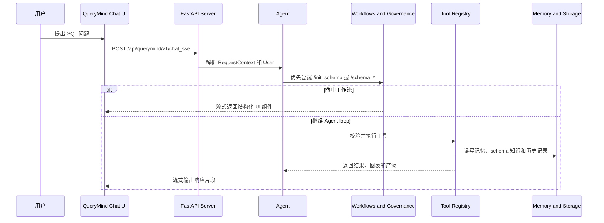

# QueryMind: 为真实业务数据库构建 SQL Agents

QueryMind 是一个面向真实 Text2SQL 场景的 LLM Agent 框架，提供 agentic retrieval 能力和企业级安全治理。

[](https://python.org)
[](README.md)
[](LICENSE)

## 企业经营数据问答个人版

本 Fork 由 [luyan9513](https://github.com/luyan9513) 持续维护，作为企业经营数据问答方向的个人主项目。项目保留 QueryMind 上游的 Agent、Schema Memory 和 SQL Governance 基础，并完成以下个人改造与验证：

- 主 Agent 使用 DeepSeek，Mem0 LLM 与 `BAAI/bge-m3` Embedding 接入硅基流动。
- 在只读 PostgreSQL 账号下通过 `pg_catalog` 抽取主外键，支持复合外键和跨 Schema 关系。
- 实现 LLM 会话标题、历史自动刷新、Workflow 消息持久化和失败回退。
- 在 AdventureWorks 68 张表、456 个字段上完成验证，Python 全量测试 117 项通过。

上游能力、个人贡献、验证证据和后续路线见[项目归属与证据说明](docs/portfolio/ownership.md)。

https://github.com/user-attachments/assets/e87fc532-ef82-4765-96a7-e693924de5c7

<table>
  <tr>
    <td align="center" valign="top" width="33%">
      
      <br /><sub>聊天面板</sub>
    </td>
    <td align="center" valign="top" width="33%">
      
      <br /><sub>Schema 管理</sub>
    </td>
    <td align="center" valign="top" width="33%">
      
      <br /><sub>用户查询</sub>
    </td>
  </tr>
  <tr>
    <td align="center" valign="top" width="33%">
      
      <br /><sub>查询结果</sub>
    </td>
    <td align="center" valign="top" width="33%">
      
      <br /><sub>总结消息</sub>
    </td>
    <td align="center" valign="top" width="33%">
      
      <br /><sub>数据可视化</sub>
    </td>
  </tr>
</table>

---

## 🌟 核心特性

| 特性 | 说明 |
|---------|-------------|
| **🗄️ 多层记忆** | 会话存储、Agent Memory 和 Schema Memory 相互独立，避免历史、检索和 schema 知识互相污染。 |
| **🎛️ 4 种 Schema Memory 检索模式** | hybrid / vector / graph / expand 四种模式，让 Agent 能针对不同查询选择合适的 schema 检索策略。 |
| **🧮 Schema 管理** | UI 页面和命令让业务数据库元数据更容易维护、更新、人工修正，并借助 AI 丰富元数据，让 Agent 始终建立在真实业务数据之上。 |
| **🔐 SQL 安全与 RLS** | 基于 group 的工具访问控制和执行前 SQL 治理，会通过行级安全、注入检测和查询复杂度控制保护业务数据库。 |
| **🛠️ 灵活的集成能力** | QueryMind 可对接 OpenAI-compatible、Anthropic 和 vLLM 模型后端，以及 PostgreSQL、SQLite、Neo4j 等存储与数据系统。 |
| **🗒️ 可观测性** | 指标、审计日志和评测工具，让 QueryMind 运行更容易监控、检查和复现。 |

当 Agent 循环运行时，QueryMind 可以把进度更新、schema 结果、SQL 结果、图表、卡片和后续动作以流式方式返回前端，而不是只返回纯文本。

## QueryMind 相比 Vanna 2.0 的新内容

QueryMind 的灵感来自 [Vanna agent framework](https://github.com/vanna-ai/vanna)，并把 Vanna 的 webcomponents 改造成了定制化的 demo web 体验。

它在这一基础之上进一步扩展了运行时结构、治理、记忆和业务数据库集成，与 Vanna 2.0 形成了差异。

- **Schema 治理** - schema governance 会标准化 schema 检索轨迹，跟踪已发现的数据库上下文，并把 lock / recap 状态作为运行时通知显式告诉模型，同时帮助 Agent 始终落在正确的业务 schema 上。
- **SQL 治理** - SQL governance 会标准化 SQL 编写模式，把执行反馈带入下一轮推理，并把 anchor / freeze / recap 状态作为运行时通知显式告诉模型，帮助 Agent 从 SQL 语义上的 false-negative 陷阱中恢复。
- **独立的 Schema Memory** - Agent memory 和 schema memory 分工明确：agent memory 用来沉淀可复用的工具使用经验，schema memory 通过 Neo4j + Mem0 混合检索为 SQL 生成提供数据库知识锚点。
- **Schema 管理** - schema management 面板和确定性的 slash command 为 schema memory 和 schema retrieval tool 提供支撑，在正常的 LLM/tool 循环开始前先把 Agent 锚定到真实业务数据库。

### 📝 更新日志
<details>
<summary> <b>🔥 2026-05-11</b> </summary>

- 将 QueryMind 的上下文拼装链路统一为“稳定 system prompt + 消息侧 runtime notice + tool-result metadata”。
- 把动态的 schema lock、schema summary、SQL anchor / freeze / recap 以及 memory advisory 从 system prompt 路径中移出。
- 继续通过请求时过滤控制 `schema_retrieve` 的可见性，而不是修改 tool registry。
- 将 runtime notice 调整为尾部追加：保留短的可见信号，把更细的动态细节放进 metadata。
- 将 `case_when`、`null_handling`、`comparison`、`distinct` 这些 detail-expression tag 的 profile 识别补齐，并同步更新 prompt-chain / agent-loop / governance 文档以及测试，改为验证“尾部通知 + metadata snapshot”。
- 为 aggregation / rollup / 多 CTE 这类 SQL turn 增加 structural rewrite 分流，让 local repair 继续聚焦在 window / join / filtering 场景。
- 为 `case_when`、`null_handling`、`comparison` 和 `distinct` 增加 detail-family 护栏，让保持投影稳定的 turn 更保守。
- 在 test set 上，SQL accuracy 保持在 66%-72% 区间内，未出现负面影响；按最近一次对比，输入缓存命中率由 44.28% 提升至 69.35%。
</details>

## QueryMind 的 Agent Loop


## 工作方式



QueryMind 把工作流边界显式化：请求上下文和管理员路由会先于工具执行完成，随后再以结构化 UI 组件流回前端。

## 快速开始

QueryMind 提供了一个打包好的 demo agent，方便快速体验端到端能力，后端、demo 前端、记忆、治理和评测组件都已经接好。

示例 agent 的核心组装方式如下：

```python
from QueryMind import (
    Agent,
    AgentConfig,
    CompositeLlmContextEnhancer,
    CompositeWorkflowHandler,
    ExponentialBackoffStrategy,
    Neo4jMem0SchemaManagementService,
    Neo4jMem0SchemaMemory,
    PrometheusObservabilityProvider,
)
from QueryMind.core.agent import build_schema_governance_stack, build_sql_governance_stack
from QueryMind.core.enricher import SchemaRetrieveContextEnricher
from QueryMind.integrations.agentmemory import Mem0AgentMemory, create_config_from_env
from QueryMind.integrations.auditlogger import PostgresAuditLogger
from QueryMind.integrations.llmservice import OpenAILlmService
from QueryMind.integrations.local import FileSystemConversationStore
from QueryMind.integrations.schemamemory import Mem0VectorConfig, Neo4jConfig
from QueryMind.rls_registry import RLSToolRegistry

schema_governance = build_schema_governance_stack()
sql_governance = build_sql_governance_stack()

agent = Agent(
    llm_service=OpenAILlmService(...),
    tool_registry=RLSToolRegistry(audit_logger=PostgresAuditLogger(...)),
    user_resolver=...,
    agent_memory=Mem0AgentMemory(config=create_config_from_env()),
    conversation_store=FileSystemConversationStore(...),
    config=AgentConfig(...),
    workflow_handler=CompositeWorkflowHandler([...]),
    schema_memory=Neo4jMem0SchemaMemory(
        neo4j_config=Neo4jConfig.from_env(),
        mem0_config=Mem0VectorConfig.from_env(),
    ),
    schema_management_service=Neo4jMem0SchemaManagementService(...),
    hooks=[schema_governance.hook, sql_governance.hook],
    llm_middlewares=[schema_governance.middleware, sql_governance.middleware],
    llm_context_enhancer=CompositeLlmContextEnhancer([...]),
    context_enrichers=[SchemaRetrieveContextEnricher(...)],
    error_recovery_strategy=ExponentialBackoffStrategy(),
    observability_provider=PrometheusObservabilityProvider(),
)
```

### 前置条件

- QueryMind Python SDK：见 [0. QueryMind Python SDK](docs/zh/support/prerequisite.md#querymind-python-sdk)。
- PostgreSQL & PgVector：见 [1. PostgreSQL & PgVector](docs/zh/support/prerequisite.md#postgresql-pgvector)。
- AdventureWorks：见 [2. AdventureWorks](docs/zh/support/prerequisite.md#adventureworks)。
- 环境变量配置：见 [3. Environment Variables Configuration](docs/zh/support/prerequisite.md#environment-variables-configuration)。

这份部署指南还会补充 Neo4j、PostgreSQL 审计日志和 demo 前端构建所需内容。

### 依赖安装

```bash
uv sync
cd frontends/webcomponent
npm install
npm run build
```

如果你更习惯可编辑安装，也可以把 `pip install -e .` 作为 fallback。

### 使用 `querymind` 启动项目

```bash
querymind agent-only
querymind web-only
querymind demo
```

- `agent-only`：只启动后端 Agent。
- `web-only`：只启动 demo 前端。
- `demo`：同时启动后端和前端，并自动打开 demo 页面。

这三个模式同时通过 `querymind` console script 和仓库根目录的 `querymind.py` 包装器暴露。

### 直接启动

```bash
python my_agent.py
python webcomponent_demo.py --api-base http://127.0.0.1:8000
```

### Web Component

```html
<script type="module" src="./frontends/webcomponent/dist/querymind-components.js"></script>
<querymind-chat
  api-base="http://localhost:8000"
  title="QueryMind Chat">
</querymind-chat>
```

你可以在任何能加载已构建 bundle 的页面里使用它。这个组件会访问 `POST /api/querymind/v1/chat_sse`、`POST /api/querymind/v1/chat_poll` 和 `WS /api/querymind/v1/chat_websocket`。

## 完整文档

手册会把 README 展开成 components、advanced-features、use-case 和 support 页面。

- English: [docs/en/querymind.md](docs/en/querymind.md)
- 中文: [docs/zh/querymind.md](docs/zh/querymind.md)

## 进行中与未来计划

### 进行中

1. 围绕 AdventureWorks micro-benchmark 持续迭代，分析 tool-call 链路、prompt injection 模式和常见 SQL 失败模式。

<figure>
  
  <figcaption>评测驱动迭代：利用基准测试反馈持续优化提示词、治理策略和 SQL 恢复行为。</figcaption>
</figure>

2. 基于 BIRD-SQL 评估 QueryMind 的 text-to-SQL 能力。


### 未来计划

1. 在 QueryMind 之上探索 Agentic RL。
2. 优化 schema retrieval 的 query 改写逻辑，让复杂的用户问题可以拆成多次 schema-retrieve 调用，减少多表 / 多字段描述被压缩成单句 query 后陷入检索 dead-end 的概率。
3. 探索替代性的 schema retrieval / indexing 架构，包括 PageIndex 风格的推理优先、轻向量或无向量 RAG 范式，以及更强的基于业务 schema 图的多跳检索。
4. 增加业务层面的收敛选项，例如人工选择业务领域，在检索开始前先缩小 schema-retrieve 的搜索范围。
5. 持续结合评测结果和治理反馈打磨 Agent。

<a id="license"></a>

## 许可证

QueryMind 采用 MIT License 发布，详见 [LICENSE](LICENSE)。

本项目出于个人学习与研究目的而开发。特别感谢 [Vanna](https://github.com/vanna-ai/vanna)，作为本工作的一个重要参考点和灵感来源。
