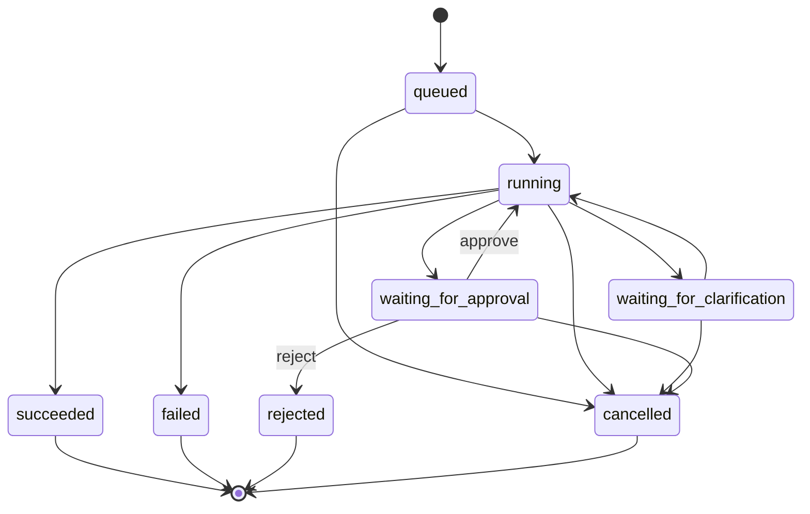

# v0.10：可恢复、可观测、可人工接管的单 Agent 运行时

状态：`v0.10-A1 生命周期骨架已实现，完整运行时仍在开发`（2026-08-04）。

## 当前实现结果

本轮在不安装新依赖、不迁移数据库、不改变现有 Text2SQL 行为的前提下完成：

- `AgentRun` / `AgentRunEvent` 领域模型、八种状态、允许转换和终态；
- `AgentRunStore` 抽象，以及内存测试 Store 和原子 JSON 开发 Store；
- 文件 Store 使用临时文件、`fsync` 和 `os.replace`，进程重启后可读取 Run、事件和幂等索引；
- `POST /api/querymind/v1/agent-runs`：必须提供 `Idempotency-Key`，同请求返回原 Run，不同请求复用同键返回 409；
- `GET /api/querymind/v1/agent-runs/{run_id}`：按服务端解析的租户和用户隔离；
- `GET /api/querymind/v1/agent-runs/{run_id}/events?after=N`：按单调序号增量读取历史事件；
- `POST /api/querymind/v1/agent-runs/{run_id}/cancel`：支持版本检查和幂等取消；
- 正常 `my_agent.py` 启动入口挂载 `QUERYMIND_AGENT_RUNS_DIR`，默认写入项目数据目录下的 `agent_runs`；
- 完整回归 `229 passed, 1 warning`，新增文件 Ruff 检查和 `git diff --check` 通过。

当前边界：新建 Run 只进入 `queued`，尚未由后台 Worker 驱动现有 Chat Agent；事件接口是可续读的 JSON 历史查询，还不是持续等待的新事件 SSE；文件 Store 只保证单进程内互斥，不保证多实例事务；Step/Tool、Trace、审批、澄清和反馈仍未实现。

## 决策摘要

v0.10 不重写 Text2SQL 核心，也不引入多 Agent。保留当前“单 Agent + 有界工具循环 + Query Plan + 确定性 SQL Governance + Schema/语义合同”的有效能力，补齐四个生产化缺口：

1. 持久化运行状态：每次问答都有可查询、可恢复、可取消的 Run；
2. 端到端可观测：意图、检索、计划、模型、治理、SQL、验证都能串成同一条 Trace；
3. 风险型人机协同：真正支持暂停、审批、拒绝和原状态恢复；
4. API 与并发边界：幂等、错误码、事件流、租户/用户隔离和资源限制可解释。

这一步的目标不是增加更多“模型角色”，而是让现有 Agent 的每个决定可保存、可解释、可恢复、可评测。

## Agent 范式

本项目采用：

> 单 Agent 受治理工具循环（governed tool loop）。Agent 负责理解问题、规划和选择工具；确定性组件负责权限、安全和执行门禁；高风险或业务歧义由人接管。

边界如下：

- Agent 可以：识别意图、检索 Schema/合同、提交计划、生成或修复 SQL、总结结果。
- Agent 不可以：绕过 RLS/Governance、执行写操作、无限重试、把自己的复核当成事实证明。
- 确定性系统负责：只读检查、权限、预算、重复失败停止、SQL/计划对齐、审批策略、审计。
- 人负责：确认业务口径、批准敏感查询、处理系统无法安全判断的歧义。

## 目标状态机

终态为 `succeeded / failed / rejected / cancelled`。恢复必须从持久化状态继续，不能重新执行已经完成的 SQL。

每个 Run 内部按以下阶段推进：

`intent.classify → schema.retrieve → query.plan → llm.generate_sql → governance.validate → approval.wait? → sql.execute → result.validate → answer.generate`

## API 设计与实现状态

| 方法与路径 | 用途 | 关键要求 |
| --- | --- | --- |
| `POST /api/querymind/v1/agent-runs` | 创建运行 | **已实现**：幂等键、201/200 和复用冲突 |
| `GET /api/querymind/v1/agent-runs/{run_id}` | 获取当前状态 | **已实现**：租户/用户隔离，返回脱敏问题预览 |
| `GET /api/querymind/v1/agent-runs/{run_id}/events` | 增量读取事件 | **部分实现**：支持 `after` 续读历史事件，持续 SSE 待实现 |
| `POST /api/querymind/v1/agent-runs/{run_id}/cancel` | 取消运行 | **已实现**：版本检查、状态门禁和幂等重复取消 |
| `POST /api/querymind/v1/agent-runs/{run_id}/approvals` | 批准或拒绝 | 待 v0.10-C 实现 |
| `POST /api/querymind/v1/agent-runs/{run_id}/clarifications` | 回答 Agent 的澄清 | 待 v0.10-C 实现 |
| `POST /api/querymind/v1/agent-runs/{run_id}/feedback` | 提交反馈 | 待 v0.10-D 实现 |

现有 SSE、WebSocket、轮询和会话 API 在实施期保持兼容；新 API 先作为并行版本，不做破坏性替换。

## 数据模型草案

### `agent_runs`

- `id`、`tenant_id`、`user_id`、`conversation_id`
- `database_id`、`status`、`current_stage`、`risk_level`
- `question_redacted`、`result_summary_redacted`
- `model_profile`、`policy_version`、`schema_snapshot_id`、`contract_version`
- `idempotency_key`、`created_at`、`started_at`、`completed_at`
- `error_code`、`error_category`

### `agent_steps`

- `run_id`、`step_index`、`stage`、`status`
- `input_ref`、`output_ref`：指向受控载荷，不在日志复制明细数据
- `started_at`、`completed_at`、`latency_ms`
- `retry_of_step_id`、`failure_fingerprint`

### `tool_calls`

- `run_id`、`step_id`、`tool_name`、`status`
- `arguments_redacted`、`result_metadata_redacted`
- `token_usage`、`estimated_cost`、`latency_ms`

### `approval_requests`

- `run_id`、`status`、`reason_code`、`risk_summary_redacted`
- `requested_at`、`decided_at`、`decided_by`、`decision_reason`
- `policy_version`、`expires_at`

### `user_feedback` 与 `run_events`

反馈保存用户判断和原因；事件表保存单调递增序号、事件类型和脱敏载荷，为 SSE 续传和审计提供依据。

当前先用独立原子文件 Run Store 验证接口和状态语义，没有复用非原子会话写入。它仍只适合单进程开发；多实例运行必须使用支持事务、唯一约束和行级隔离的数据库 Store。Step、Tool、Approval 和 Feedback 仍是目标模型，尚未落盘。

## 错误与恢复

统一错误分类，避免把所有失败都交给模型猜：

| 类别 | 示例 | 默认动作 |
| --- | --- | --- |
| `schema_insufficient` | 缺表、缺字段、图路径不足 | 有界重新检索；仍不足则澄清 |
| `sql_syntax` | 方言或语法错误 | 同一证据下修复一次 |
| `governance_blocked` | 写操作、元数据、无证据字段 | 安全错误直接停止；可修复错误返回具体原因 |
| `semantic_ambiguous` | 收入口径、时间范围不明确 | 请求澄清或数据负责人审批 |
| `permission_denied` | RLS/数据源权限不足 | 不重试，返回可解释权限错误 |
| `provider_transient` | 超时、限流、临时 5xx | 指数退避和有限重试 |
| `provider_permanent` | 鉴权、余额、模型不存在 | 不重试，记录供应商错误类别 |
| `result_invalid` | 空结果异常、粒度/列结构不符 | 有证据时修复，否则停止或澄清 |

每类错误都有最大尝试次数和总工具预算。相同失败指纹重复出现时提前停止。

## 人机协同策略

首版只对确有业务价值的情况暂停：

- 指标合同存在多个有效口径且用户问题无法唯一确定；
- 查询涉及敏感明细、较大导出或管理员配置的高风险域；
- Governance 判定“允许人工放行”，而不是绝对禁止；
- 结果校验发现高影响异常但没有足够证据自动修复。

危险写操作、明显越权和禁止的元数据访问不可通过人工按钮绕过。审批页面只展示脱敏问题、SQL 指纹、使用的表/字段、风险原因和预计扫描范围；敏感常量默认遮盖。

## 可观测性与脱敏

每个 Run 生成统一 `trace_id`，Run、Step、Tool、审批、反馈和日志都带 `tenant_id / user_id / run_id / trace_id`。核心指标：

- 各阶段耗时、成功率和错误分类；
- Schema 检索模式、候选数量、命中证据和重检次数；
- 计划接受/误拦、Governance 决策和恢复动作；
- SQL 执行状态、返回行列数、扫描/超时信息（数据库支持时）；
- 工具轮数、Token、成本、审批等待和用户反馈。

默认不记录连接串、密钥、完整行数据、敏感常量和未脱敏模型原文。开发调试若需更高日志级别，必须显式开启、限制保存期并禁止提交。

## 多用户并发与工程边界

- 所有记录必须带租户和用户身份，读取与写入均检查归属；
- 创建运行使用幂等键，防止网络重试重复执行 SQL；
- 同一 Run 采用版本号或数据库锁，避免审批、取消和执行并发竞态；
- 对每用户、租户、数据源设置并发、排队、工具轮数、SQL 超时和结果行数限制；
- 进程重启后恢复 `queued/running/waiting_*`，对执行状态不明的 SQL 采取 fail-closed，不盲目重放；
- 模型并发与数据库连接池分开限制，避免一个慢供应商拖垮查询连接。

## 分阶段实施

### v0.10-A：运行状态与事件骨架

- 定义 Run/Step/Event 模型、状态转换和错误码；
- 新增版本化 Run API、幂等创建、查询、取消和 SSE 续传；
- 先接入现有单 Agent，不改变 SQL 生成和治理策略；
- 单元测试状态机、越权、幂等和竞态。

验收：进程重启后能查询等待态/终态；重复请求只创建一个 Run；同一 Run 事件有序且可续传。

当前进度：A1 已完成状态模型、原子文件持久化、幂等创建、用户隔离、取消和历史事件续读。A2 待完成后台执行适配、持续 SSE、启动恢复策略和并发取消；因此不能把整个 v0.10-A 标记为完成。

### v0.10-B：端到端 Trace 与脱敏

- 把现有指标和 request/conversation 标识串成统一 Trace；
- 为检索、计划、模型、治理、SQL 和结果验证增加结构化 Span；
- 建立脱敏测试和运行详情审计视图。

验收：每个评测样本能回溯完整阶段；日志扫描不出现密钥、连接串和配置的敏感值。

### v0.10-C：可暂停审批与澄清

- 实现审批/澄清持久化和原状态恢复；
- 增加风险策略、过期、拒绝、取消和并发决策处理；
- 用模拟数据验证越权审批和重复审批。

验收：暂停期间不占用 Agent/数据库连接；批准后不重做已完成步骤；拒绝后绝不执行 SQL。

### v0.10-D：评测接入与基准恢复

- 把过程指标、安全场景和 HITL 指标接入评测框架；
- 将 Chinook 100 题按 `60/20/20` 冻结分层；
- 对候选版本做重复真实模型评测和并发/故障注入。

验收：同时报告结果质量、过程质量、安全、人机协同、延迟和成本；没有只报一个准确率。

## 暂停 v0.9 扩题的原因

当前 50 题已足以暴露下一阶段工程缺口。继续机械扩到 100，再改 Run/Trace/HITL 数据结构，会产生两次报告和采集迁移。决定先冻结 50 题开发集，不跑 50 题模型、不声称准确率；v0.10 核心接口稳定后再补齐并冻结 100 题。

## 上游与个人归属

上游已有 Agent Loop、工具注册、SQL Governance、Schema Memory、RLS、FastAPI、Web Component、会话存储和基础评测框架。个人已实现 Query Plan、失败实验、语义合同、多数据源隔离和系统化评测。

v0.10 的 Run 状态机、版本化 API、持久化 Step/Event、统一 Trace、风险审批、澄清恢复、幂等与并发策略是本次个人设计。当前可以写成已实现的只有 Run/Event 生命周期骨架、开发文件 Store、幂等/隔离/取消接口和对应测试；Step/Trace/HITL/多实例能力仍不能写成成果。

后续每一步实际操作、验证、错误与取舍统一记录在外层 `reports/audit/v0.10-implementation-journal.md`，不能只更新最终结果。

## 参考的官方工程实践

- [Anthropic：Building effective agents](https://www.anthropic.com/engineering/building-effective-agents)——优先使用可组合、可理解的简单模式，仅在收益明确时增加复杂度。
- [Anthropic：Demystifying evals for AI agents](https://www.anthropic.com/engineering/demystifying-evals-for-ai-agents)——将任务、轨迹、结果和多次试验纳入评测。
- [OpenAI Agents SDK：Tracing](https://openai.github.io/openai-agents-python/tracing/)——以 Trace/Span 记录 Agent、模型、工具和 Guardrail 阶段。
- [OpenAI Agents SDK：Human-in-the-loop](https://openai.github.io/openai-agents-python/human_in_the_loop/)——高风险工具调用需要可暂停状态和恢复能力。

这些资料用于设计取舍；v0.10 不因此迁移到新的 Agent 框架。本轮实现复用现有 FastAPI/Pydantic 与 Python 标准库，没有新增依赖。FastAPI Header、动态状态码和 Response 用法另按 2026-08-04 官方文档核对。
